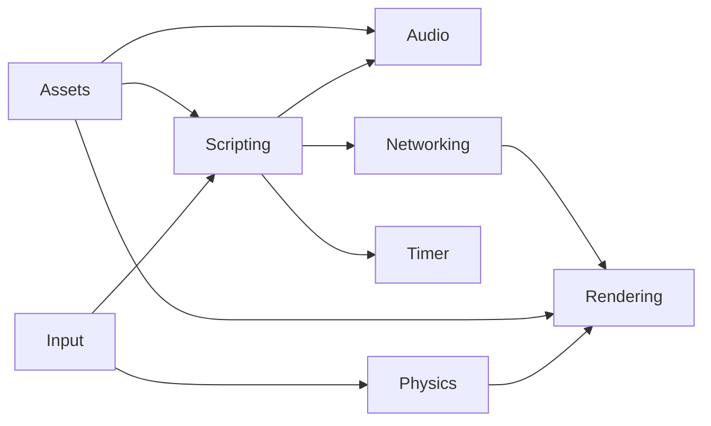

# Roll Back Engine

An engine that's used for a work in progress fighting game.

### Dependencies & Tools

* [SDL2](https://www.libsdl.org/download-2.0.php)
* [SDL2 mixer](https://libsdl.org/projects/SDL_mixer/)
* [Freetype Library](https://www.freetype.org/download.html)
* [GNU Make](http://gnuwin32.sourceforge.net/packages/make.htm)
* [7Zip](https://www.7-zip.org/download.html)

### Instructions

Must install make in order to run commands.

##### Build and Compile Game

`make build`

##### Run Game

`make run`

##### Clean Project

`make clean`

##### Format

`make format`

*Must have astyle installed and added to `PATH`.

##### Package and Export Game

`make package`

*Must have 7zip installed and added to the `PATH`.

##### Architecture

Systems and their connections.

